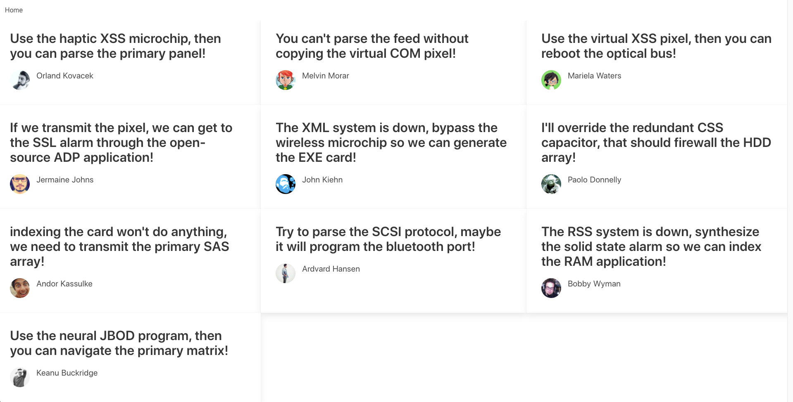

# Nuxt Challenge

This nuxt project is configured to use Bulma as the CSS framework.

## Description

There is a list of users inside of output.json.

One record looks like:

```json
  {
    "id": 0,
    "avatar": "https://s3.amazonaws.com/uifaces/faces/twitter/lebinoclard/128.jpg",
    "firstName": "Orland",
    "lastName": "Kovacek",
    "quote": "Use the haptic XSS microchip, then you can parse the primary panel!",
    "address": "07522 Furman Ridges Apt. 198"
  },
```

`data.js` uses the the records from `output.json` and makes the data available to all components.

## Task 1

Create a responsive component using Bulma CSS.

Your task is to create a mobile website that looks like the following:


And on the desktop it should show 3 cards per row:



`components/card.vue` has been set up for you. This is where you'll need to make the changes for this task.

## Task 2

Clicking on one of the cards will take you to a specific user's profile, which has also been set up for you inside of `pages/users/_id/index.vue`.

The current user needs to be set inside of the `mounted()` callback. This should look up the user using a key/value pair (key is user id, value is the whole user). You will need to add code to the `data.js` file to allow for this lookup.

## Some tips:

The default nuxt configuration can be picky with the style of the code. You can run `npm run lint:fix` to automatically fix these errors.

https://bulma.io/documentation/components/card/#
https://bulma.io/documentation/overview/responsiveness/


## Build Setup

```bash
# install dependencies
$ npm install

# serve with hot reload at localhost:3000
$ npm run dev

# build for production and launch server
$ npm run build
$ npm run start

# generate static project
$ npm run generate
```

For detailed explanation on how things work, check out [Nuxt.js docs](https://nuxtjs.org).
